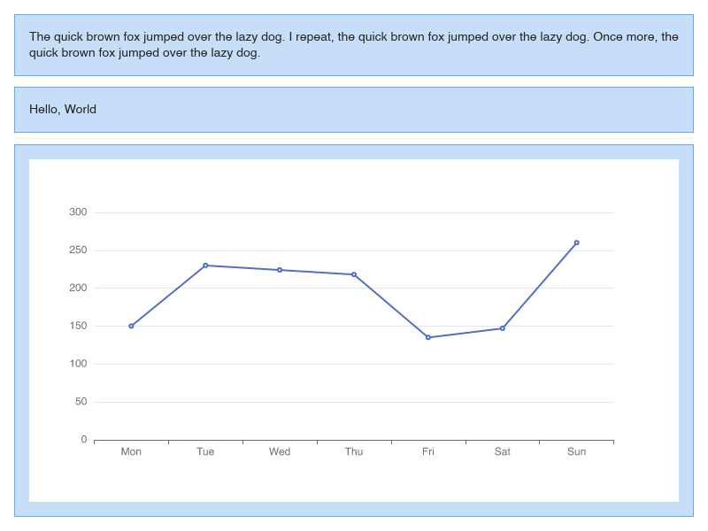
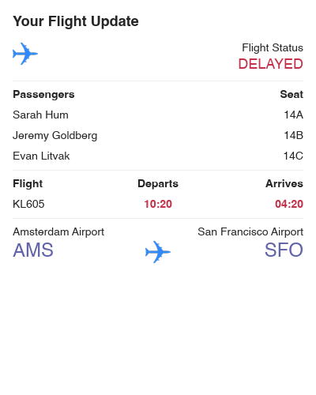

# `slipwayhq.render`

A [Slipway](https://slipway.co/) Component which takes an [Adaptive Cards](https://adaptivecards.io/)
definition as an input and returns a rendered [canvas](https://slipway.co/docs/guides/canvases).

This uses a custom Adaptive Cards renderer written in Rust. Not all Adaptive Cards features have been implemented yet,
but there are sufficient features implemented to be useful.

## Callouts

One of the most powerful features of this Component is its ability to call out to other rendering Components.
When this Component calls out to other rendering Components it provides the exact width and height that Component
needs to render to such that the result can be perfectly inserted into the resulting canvas.

This makes the `slipwayhq.render` Component excellent for general layout of text, while calling out to
other Components (such as [slipwayhq.echarts](https://github.com/slipwayhq/slipway_echarts)) for more complex
graphics.

Callouts to other components is achieved by:

### 1. Including callout definitions

When adding the `slipwayhq.render` Component to the Rig you must include
[callout definitions](https://slipway.co/docs/basics/rigs#riggingcallouts) for any Components
which you want the renderer to call out to.

In the example below the callout definition for `slipwayhq.echarts` looks like this:
```json
"callouts": {
  "echarts": {
    "component": "slipwayhq.echarts.0.5.1",
    "allow": [
      { "permission": "fonts" },
      { "permission": "registry_components" }
    ]
  }
}
```

This allows the `slipwayhq.echarts` component to be called via the handle `echarts`, and gives it permission
to load fonts and other registry components.

### 2. Use a `component://` URL for an Adaptive Cards Image element.

The URL should include query string parameters defining the width and height, which use the `$width` and `$height`
interpolation strings.

In the example below the URL provided is:

```json
"url": "component://echarts?width=$width&height=$height",
```

The `slipwayhq.render` Component will replace `$width` and `$height` with the measured width and height,
and Slipway will apply all query string parameters to the Component input before running the Component.

### 3. Add a `body` to the Adaptive Cards Image element.

The `body` parameter isn't part of the official Adaptive Cards spec, but Slipway uses it as the input
to the component if supplied.

### 4. Ensure the Adaptive Cards Image height is set to `stretch`.

This is important to ensure we measure the correct desired height of the image to pass to the Component.

### Example

You can see a full example Rig below. If you save the Rig to your file system you can run it with:
```sh
slipway run path/to/rig.json --allow-registry-components --allow-fonts
```
In the example I've set the chart background to non-transparent so you can see that it has been sized correctly.

Keep in mind this Rig has not been designed to look pretty, but the output should look something like:



```json title="Example Rig with ECharts callout"
{
  "description": "A slipway rig which renders some text and a chart.",
  "constants": {
    "width": 800,
    "height": 600
  },
  "rigging": {
    "render": {
      "component": "slipwayhq.render.0.6.0",
      "callouts": {
        "echarts": {
          "component": "slipwayhq.echarts.0.5.1",
          "allow": [
            { "permission": "fonts" },
            { "permission": "registry_components" }
          ]
        }
      },
      "allow": [
        { "permission": "fonts" },
        { "permission": "registry_components" }
      ],
      "input": {
        "canvas": {
          "width": "$.constants.width",
          "height": "$.constants.height"
        },
        "card": {
          "type": "AdaptiveCard",
          "version": "1.5",
          "body": [
            {
              "type": "Container",
              "style": "accent",
              "separator": true,
              "items": [
                {
                  "type": "TextBlock",
                  "text": "The quick brown fox jumped over the lazy dog. I repeat, the quick brown fox jumped over the lazy dog. Once more, the quick brown fox jumped over the lazy dog.",
                  "wrap": true
                }
              ]
            },
            {
              "type": "Container",
              "style": "accent",
              "separator": false,
              "items": [
                {
                  "type": "TextBlock",
                  "text": "Hello, World"
                }
              ]
            },
            {
              "type": "Container",
              "style": "accent",
              "height": "stretch",
              "separator": true,
              "items": [
                {
                  "type": "Image",
                  "height": "stretch",
                  "url": "component://echarts?width=$width&height=$height",
                  "body": {
                    "theme": {
                      "backgroundColor": "#FFF"
                    },
                    "chart": {
                      "xAxis": {
                        "type": "category",
                        "data": [
                          "Mon",
                          "Tue",
                          "Wed",
                          "Thu",
                          "Fri",
                          "Sat",
                          "Sun"
                        ]
                      },
                      "yAxis": {
                        "type": "value"
                      },
                      "series": [
                        {
                          "data": [
                            150,
                            230,
                            224,
                            218,
                            135,
                            147,
                            260
                          ],
                          "type": "line"
                        }
                      ]
                    }
                  }
                }
              ]
            }
          ]
        }
      }
    }
  }
}
```


## Required Inputs

### `card`
The Adaptive Card JSON. See samples [here](https://adaptivecards.io/samples/).

### Canvas

An object describing the canvas which will be drawn on.
The renderer can either create a new canvas, or write to an existing one.

The properties here indicate which of those scenarios we want.

#### Required Properties

##### `width`
The width of the canvas.

##### `height`
The height of the canvas.

#### Optional Properties

##### `data`
[Encoded](https://slipway.co/docs/basics/host-api#binary-encoding-and-decoding) vector of RGBA bytes.

If omitted a new image will be created.
If included the supplied image must match the provided `width` and `height` and will be drawn onto.

##### `rect`

The rectangle to draw the rendered card in, consisting of `x`, `y`, `width`, and `height` properties.
If omitted, the full image will be used.

## Optional Inputs

### `host_config`

The Adaptive Cards [Host Config](https://learn.microsoft.com/en-us/adaptive-cards/rendering-cards/host-config)
definition which defines device specific rendering properties (font sizes, colors, etc.).

### `debug`

Boolean. If true, bounding boxes will be drawn around each element in the Adaptive Card.

## Suggested Permissions

### `--allow-registry-components`
### `--allow-http-components`
### `--allow-local-components`

This component has the ability to call out to other rendering components, but doing so will require the
appropriate permissions.

### `--allow-fonts`

This component may need to access fonts from the local system.

### `--allow-http`

If the Adaptive Cards definition contains images which need to be loaded from the internet, then HTTP access may be required.

## Example Usage

Test the component by running the following command and pasting in the input when prompted:
```
slipway run-component "slipwayhq.render.0.6.1" --allow-fonts --allow-http
```

Input:
```json
{
  "canvas": {
    "width": 400,
    "height": 500
  },
  "card": {
    "type": "AdaptiveCard",
    "version": "1.6",
    "body": [
      {
        "type": "TextBlock",
        "text": "Your Flight Update",
        "wrap": true,
        "style": "heading"
      },
      {
        "type": "ColumnSet",
        "columns": [
          {
            "type": "Column",
            "width": "auto",
            "items": [
              {
                "type": "Image",
                "size": "small",
                "url": "https://adaptivecards.io/content/airplane.png",
                "altText": "Airplane"
              }
            ]
          },
          {
            "type": "Column",
            "width": "stretch",
            "items": [
              {
                "type": "TextBlock",
                "text": "Flight Status",
                "horizontalAlignment": "right",
                "isSubtle": true,
                "wrap": true
              },
              {
                "type": "TextBlock",
                "text": "DELAYED",
                "horizontalAlignment": "right",
                "spacing": "none",
                "size": "large",
                "color": "attention",
                "wrap": true
              }
            ]
          }
        ]
      },
      {
        "type": "ColumnSet",
        "separator": true,
        "spacing": "medium",
        "columns": [
          {
            "type": "Column",
            "width": "stretch",
            "items": [
              {
                "type": "TextBlock",
                "text": "Passengers",
                "isSubtle": true,
                "weight": "bolder",
                "wrap": true
              },
              {
                "type": "TextBlock",
                "text": "Sarah Hum",
                "spacing": "small",
                "wrap": true
              },
              {
                "type": "TextBlock",
                "text": "Jeremy Goldberg",
                "spacing": "small",
                "wrap": true
              },
              {
                "type": "TextBlock",
                "text": "Evan Litvak",
                "spacing": "small",
                "wrap": true
              }
            ]
          },
          {
            "type": "Column",
            "width": "auto",
            "items": [
              {
                "type": "TextBlock",
                "text": "Seat",
                "horizontalAlignment": "right",
                "isSubtle": true,
                "weight": "bolder",
                "wrap": true
              },
              {
                "type": "TextBlock",
                "text": "14A",
                "horizontalAlignment": "right",
                "spacing": "small",
                "wrap": true
              },
              {
                "type": "TextBlock",
                "text": "14B",
                "horizontalAlignment": "right",
                "spacing": "small",
                "wrap": true
              },
              {
                "type": "TextBlock",
                "text": "14C",
                "horizontalAlignment": "right",
                "spacing": "small",
                "wrap": true
              }
            ]
          }
        ]
      },
      {
        "type": "ColumnSet",
        "spacing": "medium",
        "separator": true,
        "columns": [
          {
            "type": "Column",
            "width": 1,
            "items": [
              {
                "type": "TextBlock",
                "text": "Flight",
                "isSubtle": true,
                "weight": "bolder",
                "wrap": true
              },
              {
                "type": "TextBlock",
                "text": "KL605",
                "spacing": "small",
                "wrap": true
              }
            ]
          },
          {
            "type": "Column",
            "width": 1,
            "items": [
              {
                "type": "TextBlock",
                "text": "Departs",
                "isSubtle": true,
                "horizontalAlignment": "center",
                "weight": "bolder",
                "wrap": true
              },
              {
                "type": "TextBlock",
                "text": "10:20",
                "color": "attention",
                "weight": "bolder",
                "horizontalAlignment": "center",
                "spacing": "small",
                "wrap": true
              }
            ]
          },
          {
            "type": "Column",
            "width": 1,
            "items": [
              {
                "type": "TextBlock",
                "text": "Arrives",
                "isSubtle": true,
                "horizontalAlignment": "right",
                "weight": "bolder",
                "wrap": true
              },
              {
                "type": "TextBlock",
                "text": "04:20",
                "color": "attention",
                "horizontalAlignment": "right",
                "weight": "bolder",
                "spacing": "small",
                "wrap": true
              }
            ]
          }
        ]
      },
      {
        "type": "ColumnSet",
        "spacing": "medium",
        "separator": true,
        "columns": [
          {
            "type": "Column",
            "width": 1,
            "items": [
              {
                "type": "TextBlock",
                "text": "Amsterdam Airport",
                "isSubtle": true,
                "wrap": true
              },
              {
                "type": "TextBlock",
                "text": "AMS",
                "size": "extraLarge",
                "color": "accent",
                "spacing": "none",
                "wrap": true
              }
            ]
          },
          {
            "type": "Column",
            "width": "auto",
            "items": [
              {
                "type": "TextBlock",
                "text": " ",
                "wrap": true
              },
              {
                "type": "Image",
                "url": "https://adaptivecards.io/content/airplane.png",
                "altText": "Airplane",
                "spacing": "none",
                "size": "small"
              }
            ]
          },
          {
            "type": "Column",
            "width": 1,
            "items": [
              {
                "type": "TextBlock",
                "text": "San Francisco Airport",
                "isSubtle": true,
                "horizontalAlignment": "right",
                "wrap": true
              },
              {
                "type": "TextBlock",
                "text": "SFO",
                "horizontalAlignment": "right",
                "size": "extraLarge",
                "color": "accent",
                "spacing": "none",
                "wrap": true
              }
            ]
          }
        ]
      }
    ]
  }
}
```

Output:
```json
{
  "canvas": {
    "width": 400,
    "height": 300,
    "data": "<encoded_rgba_bytes_omitted>"
  }
}
```



# Development

Development requires:

```
cargo install cargo-insta
cargo install cargo-typify
```
